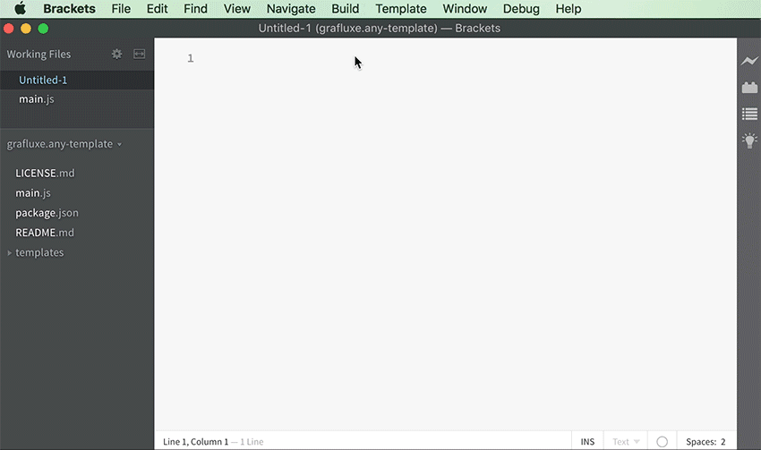

# Any Template

This Brackets extension allows you to easily create and use *your own* template files. It adds a new "Template" menu item to the main menu bar which lists any template files you create. Templates can be of any file type supported by Brackets.

## Select Template

- From the "Template" menu item, select your desired template file.
  - Template files are sorted by type.
- Once a file is selected, you will be presented with the following options:
  - Create Untitled Document
  - Overwrite Current Document
  - Cancel

## Add/Edit Templates

- From the "Template" menu item, select "Templates Folder..."
- Add any file type supported by Brackets.
- Restart Brackets to see updated files.

## Install Extension

In the Brackets Extension Manager, either:

- Search for Any Template
- Use the "install from URL" option and paste in `https://github.com/Grafluxe/any-template`

Restart Brackets after install.

## License

Copyright (c) 2016 Leandro Silva (http://grafluxe.com)

Released under the MIT License.

See LICENSE.md for entire terms.
